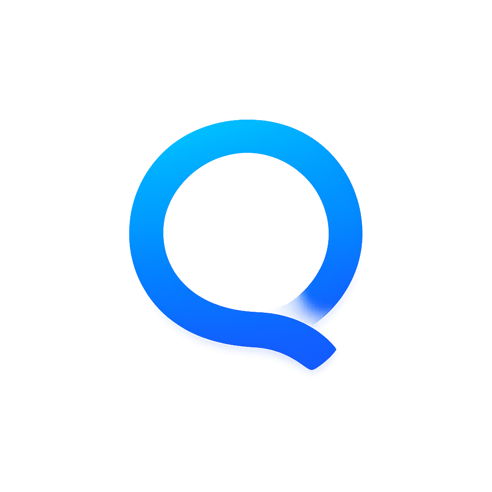

  
  
<strong>AuroriaLink</strong>

**AuroriaLink** est une messagerie d'équipe contextuelle et temps réel, conçue pour résoudre la désynchronisation entre les outils de communication et les outils de production.

Le principe architectural fondamental est le **lien contextuel** : chaque fil de discussion est intrinsèquement lié à un objet de référence (une tâche, un projet, un document). La conversation n'est plus une entité isolée, mais une métadonnée de l'objet auquel elle se rapporte. Cette approche garantit une traçabilité absolue et supprime le bruit informationnel des canaux généralistes.

### ⚠️ Statut du projet : Version Alpha

> Ce projet est actuellement en phase de développement actif. Des bugs et des comportements inattendus sont donc probables. Toute contribution ou retour d'expérience est le bienvenu.

---

### ✨ Fonctionnalités Clés

* **Communication Temps Réel** : Architecture basée sur un serveur **WebSocket (Node.js)** pour des échanges full-duplex instantanés et une synchronisation immédiate entre tous les clients.
* **Modularité & Intégration** : Conçu comme un module autonome, AuroriaLink peut fonctionner en application indépendante ou être intégré comme un service dans une application tierce via son API.
* **Backend Robuste** : Un backend en **PHP 8.4 / PostgreSQL** assure la persistance des messages, la gestion des utilisateurs, des droits et des canaux.
* **Client Multiplateforme** : Le client, développé en **Flutter**, offre une expérience utilisateur unifiée, performante et native sur desktop (Windows, macOS, Linux) et mobile (Android, iOS).
* **API Contextuelle** : L'API permet non seulement d'envoyer et recevoir des messages, mais aussi de créer et lier dynamiquement des conversations à des identifiants d'objets externes.
* **Sécurité** : Gestion des droits et cloisonnement des canaux basés sur les rôles pour un accès sécurisé et contextuel aux conversations.

---

## 🛠️ Stack Technologique

  
  
  
  
  
  

---
## 💻 Plateformes supportées

| Plateforme | Support |
|------------|---------|
| Android    | ✅ |
| Windows    | ✅ |
| Linux      | ✅ | 
| macOS      | ❌ non supporté pour le moment |
| iOS        | ❌ non supporté pour le moment |

---
## Theme clair

## Theme Sombre

---
#  Axomind & Framework Maison

  

AuroriaLink est né du projet en cours de developpement **Axomind**, une application tout-en-un de pilotage d'équipe reposant sur trois modules interconnectés : la planification de tâches sur le temps (`🗓️`), la structuration d'idées (`🧠`) et la communication (`💬`).

L'ensemble de ces projets s'appuie sur un **framework Flutter modulaire personnel**, conçu autour de principes stricts :
* **Modularité** : Chaque bloc (UI, logique, services) est indépendant.
* **Interopérabilité** : Les composants interagissent dynamiquement sans dépendances rigides.
* **Adaptabilité** : Le comportement s'ajuste selon le contexte (utilisateur, plateforme).
* **Séparation des responsabilités** : Cloisonnement strict entre logique métier, UI, données et configuration.

## Theme clair

## Theme Sombre

---

  
  
<strong>Qodexus</strong>

  
<em>Architecte de solutions pragmatiques, du concept à la production.</em>

