<div align="center">
  
  <h1>AuroriaLink</h1>
  <p><strong>A contextual, real-time team messaging solution.</strong></p>
  
  <p>
    
    
  </p>

  <p align="center">
    
    
  </p>
</div>


**AuroriaLink** is a contextual, real-time team messaging solution designed to solve the desynchronization between communication and production tools.

The fundamental architectural principle is the **contextual link**: each discussion thread is intrinsically linked to a specific production element. The conversation is no longer an isolated entity but the dynamic metadata of the object to which it relates, whether it is **a node in a project tree (mindmap `🧠`)** or **a task in a timeline planner (`🗓️`)**.

This approach ensures absolute traceability and anchors communication directly within the workflow, eliminating the informational noise of general-purpose channels.

Built with a core philosophy of **intelligent optimization**, AuroriaLink minimizes server costs through smart resource management while maintaining performance and security.
---

## 🚀 Get the Latest Version

<div align="center">
  <table>
    <tr>
      <td align="center" width="33%">
        <a href="https://github.com/Sebastien-VZN/auroria_link/releases/download/alpha_0.4.0/app-android_0.4.0.apk">
          
        </a>
        <br/>
        <sub>APK • All versions</sub>
      </td>
      <td align="center" width="33%">
        <a href="https://github.com/Sebastien-VZN/auroria_link/releases/download/alpha_0.4.0/windows_0.4.0.zip">
          
        </a>
        <br/>
        <sub>ZIP • Windows 10+</sub>
      </td>
      <td align="center" width="33%">
        <a href="https://github.com/Sebastien-VZN/auroria_link/releases/download/alpha_0.4.0/linux_0.4.0.tar.gz">
          
        </a>
        <br/>
        <sub>TAR.GZ • All distros</sub>
      </td>
    </tr>
  </table>
</div>

<p align="center">
  <a href="https://github.com/Sebastien-VZN/auroria_link/releases">
    
  </a>
</p>

## 📋 Table of Contents

- [⚠️ Project Status](#️-project-status-alpha-version)
- [✨ Key Features](#-key-features)
- [🛠️ Tech Stack](#️-tech-stack)
- [💻 Supported Platforms](#-supported-platforms)
- [🚀 Installation](#-installation)
- [🎨 Gallery](#-gallery)
- [🌱 Origins: Axomind & Custom Framework](#-origins-axomind--custom-framework)
- [🤝 Contributing & Feedback](#-contributing--feedback)
- [👤 Author](#-author)
- [🇫🇷 Version Française](#-version-française)

---

### ⚠️ Project Status: Alpha Version

> This project is currently in active development. Bugs and unexpected behaviors are therefore likely. All feedback is welcome.

---

### ✨ Key Features

-   **⚡ Real-Time Communication**: Architecture based on a **WebSocket (Node.js)** server for instant, full-duplex exchanges with heartbeat monitoring (30s) and automatic reconnection.
-   **🔒 Absolute Privacy & Encryption**: The messaging is **100% private**. All messages and files are **encrypted at rest on the server** with **AES-256-GCM** (streaming chunks 8MB). Communications transit via **HTTPS** and **WSS (WebSocket Secure)**, ensuring end-to-end maximum security.
-   **🚀 High-Performance Backend**: 4-level RAM cache architecture (OPcache → APCu → Ramdisk → Redis) delivering **-80% CPU decrypt load**, **+150% throughput**, and **×2 bandwidth**. Persistent database connections and 11 critical indexes ensure ultra-fast queries.
-   **⏱️ Optimized Message Retention**: Messages are retained for 15 days on the server and 3 months on the client, with an option for automatic deletion after 24 hours for maximum confidentiality. Daily cleanup at midnight to limit server load and optimize storage costs.
-   **📱 Multi-Device Support**: Switch seamlessly between your devices (desktop or mobile) with automatic session management. **Maximum 2 simultaneous connections** per user for optimal security and resource management.
-   **🔄 Smart Reconnection**: Automatic reconnection with exponential backoff in case of network loss, with 2FA validation when necessary to ensure your session security.
-   **🛡️ 5-Layer Security**: Route validation, brute force protection with IP tracking, 2FA via email (PIN 6-digit), AES-256-GCM encryption, and intelligent multi-device management.
-   **👥 Private Discussion Channels**: Create partitioned channels for specific teams, projects, or topics, accessible only to authorized members.
-   **🎤 Sequential Audio Messaging**: Record and send encrypted audio clips to create a fluid vocal conversation thread.
-   **📎 Comprehensive File Sharing**: Share encrypted documents, images, videos, and audio files (up to 10 files per message, 10 MB per file) directly within your contextual conversations.
-   **📌 Smart File Management**: Files are retained for 15 days on the server, or 3 months if pinned. Each pin resets the 3-month timer, allowing only important files to be retained and optimizing server storage.
-   **🧩 Modularity & Integration**: Designed as a standalone module that can be integrated as a service via its API.
-   **💪 Robust Backend**: A **PHP 8.4 / PostgreSQL 17** backend with **PHP-FPM (80 workers)** ensures data persistence, user management, and permissions with enterprise-grade reliability.
-   **🔗 Contextual API**: Securely create and link conversations to external object identifiers.
-   **🔐 Access Control**: Role-based rights management for precise and context-aware access to conversations.

---

## 🛠️ Tech Stack

<p align="center">
  <a href="https://www.php.net/" target="_blank"></a>
  <a href="https://flutter.dev/" target="_blank"></a>
  <a href="https://nodejs.org/" target="_blank"></a>
  <a href="https://www.postgresql.org/" target="_blank"></a>
  <a href="https://www.nginx.com/" target="_blank"></a>
  <a href="https://www.debian.org/" target="_blank"></a>
</p>

---

## 🏗️ Architecture

**Architecture Layers:**

<p align="center">
  
  
  
  
</p>

```
╔═════════════════════════════════════════════════════════════╗
║                    Client Applications                      ║
║           Flutter (Android, Windows, Linux)                 ║
║                                                             ║
║  • Contextual messaging                                     ║
║  • Encrypted file sharing (AES-256-GCM)                     ║
║  • Audio messaging                                          ║
║  • Auto-reconnection (exponential backoff)                  ║
╚════════════╦═════════════════════════╦══════════════════════╝
             ║ HTTP/HTTPS              ║ WSS (WebSocket Secure)
             ║ (auth/data)             ║ (real-time messaging)
             ↓                         ↓
╔═════════════════════════╗   ╔════════════════════════════════╗
║   Backend Server        ║   ║   Real-Time WebSocket Server   ║
║   PHP 8.4 + Nginx       ║   ║   Node.js (quantive-ws)        ║
║   PHP-FPM (80 workers)  ║   ║                                ║
║                         ║   ║  • Port 8080 (clients)         ║
║  Security Layers:       ║   ║  • Port 8081 (internal API)    ║
║  1. Route validation    ║   ║  • Heartbeat 30s (ping/pong)   ║
║  2. Brute force ctrl    ║   ║  • Multi-device (max 2)        ║
║  3. 2FA (email PIN)     ║   ║  • Auth via PHP validation     ║
║  4. AES-256-GCM         ║←──║  • Session management          ║
║  5. Multi-device mgmt   ║   ╚════════════════════════════════╝
║                         ║
║  4-Level Cache:         ║
║  • OPcache (bytecode)   ║
║  • APCu (UUID→path)     ║
║  • Ramdisk (4GB)        ║
║  • Redis (2GB LRU)      ║
╚════════╦════════════════╝
         ║ Persistent PDO
         ║ 11 critical indexes
         ↓
╔═══════════════════════════════════════════════════════════════╗
║                 PostgreSQL 17 Database                        ║
║                                                               ║
║  • Encrypted messages (AES-256-GCM)                           ║
║  • Retention: 15 days server / 3 months client                ║
║  • Smart file retention (pinning resets 3-month timer)        ║
║  • User management, permissions & roles                       ║
║  • Indexed: users (auth), security (IP), messages (JSONB)     ║
╚═══════════════════════════════════════════════════════════════╝
```

**How it works:**
1. **Client** connects via HTTPS for auth/data and WSS for real-time messaging
2. **WebSocket Server** handles instant bidirectional communication with heartbeat (30s) and multi-device support (max 2 connections)
3. **Backend** manages 5 security layers (route validation, brute force, 2FA, AES-256-GCM, multi-device), with 4-level RAM cache for optimal performance
4. **Database** stores encrypted data with intelligent retention policies and 11 critical indexes for query optimization

**Performance optimizations** (deployed 2025-11-04):
- 4-level RAM cache: -80% CPU decrypt load, +150% throughput, ×2 bandwidth
- Persistent PDO connections: -20-40% DB latency
- 11 PostgreSQL indexes: Optimized auth, security checks, and message queries

---

## 💻 Supported Platforms

| Platform | Status                 |
|:--------:|:-----------------------|
| Android  | ✅ Supported           |
| Windows  | ✅ Supported           |
| Linux    | ✅ Supported           |
| macOS    | ❌ Not yet supported   |
| iOS      | ❌ Not yet supported   |

---

## 🚀 Installation

<details>
<summary>Click to see installation instructions</summary>

### 📱 Android Installation

> **Important:** Our application is not (yet) on the Google Play Store. Installation requires a few manual steps to allow external sources. This is a standard and secure procedure.

#### Step 1: Allow Unknown Sources
1.  **Download the `app-android.apk` file** from the [latest release](https://github.com/Sebastien-VZN/auroria_link/releases/latest ).
2.  Open the downloaded file (from your notification bar or file manager).
3.  A security prompt will appear: *"For your security, your phone is not allowed to install unknown apps from this source."*
4.  Tap on the **Settings** button.
5.  Enable the **Allow from this source** (or *Unknown sources*) option.
6.  Go back using the navigation arrow; the installation should now begin.

#### Step 2: Bypass Google Play Protect
1.  After Step 1, another window may open, titled **"Blocked by Play Protect"**.
2.  Do not tap "OK". Look for and tap on **Details** or **More details** (often a small link at the bottom).
3.  A new button will appear. Tap on **Install anyway**.

And that's it, the application is installed!

---

### 💻 Windows Installation

> **Warning:** Your antivirus software (including Windows Defender) may show an alert. This is normal behavior for applications that are not certified by Microsoft. Our file is safe.

1.  **Download the `windows.zip` archive** from the [latest release](https://github.com/Sebastien-VZN/auroria_link/releases/latest ).
2.  **Decompress the archive.**
3.  **Run the `.exe` file** located inside the extracted folder.
4.  If a blue "Windows protected your PC" screen appears:
    * Click on the **More info** link.
    * Then, click the **Run anyway** button.
5.  If your antivirus quarantines the file, open your antivirus settings and create an exception to allow the file.

---

### 🐧 Linux Installation

> For Linux, you just need to make the file executable before running it.

1.  **Download the `linux.tar.gz` archive** from the [latest release](https://github.com/Sebastien-VZN/auroria_link/releases/latest ) and decompress it.
2.  **Make the application file executable.** You have two options:
    * **Via GUI (Graphical User Interface):**
        1.  Right-click on the application file.
        2.  Go to **Properties** → **Permissions** tab.
        3.  Check the box **"Allow executing file as program"**.
    * **Via Terminal:**
        ```bash
        chmod +x file-name
        ```
        *(Replace `file-name` with the actual name of the executable file)*
3.  **Launch the application** by double-clicking it or by running it from the terminal:
    ```bash
    ./file-name
    ```

If you encounter any issues, feel free to contact us or open an issue.

</details>

---

## 🎨 Gallery

<details>
<summary>🖼️ Light Theme Screenshots</summary>

| Desktop | Mobile | Mobile | Mobile |
| :---: | :---: | :---: | :---: |
| 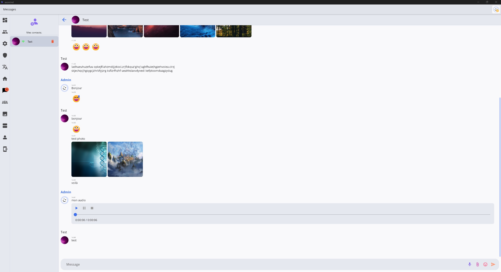 | 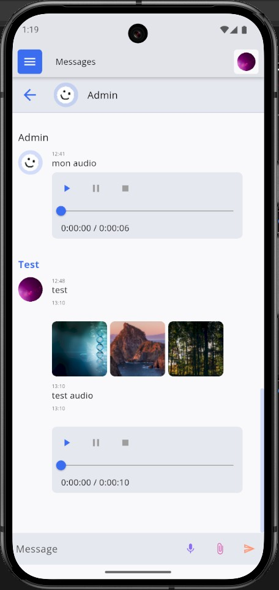 | 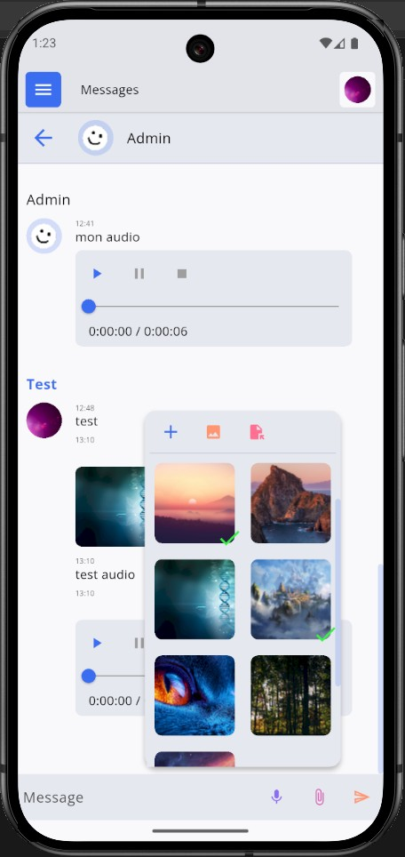 | 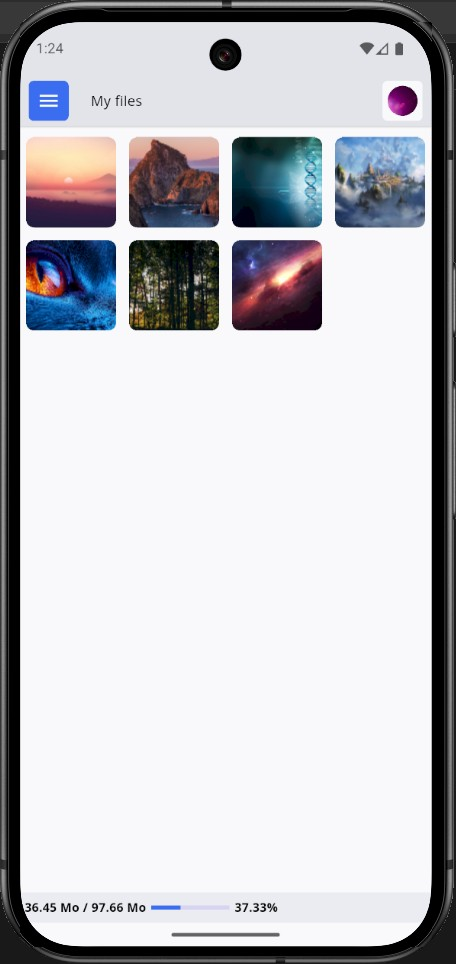 |

</details>

<details>
<summary>🌙 Dark Theme Screenshots</summary>

| Desktop | Mobile | Mobile | Mobile |
| :---: | :---: | :---: | :---: |
| 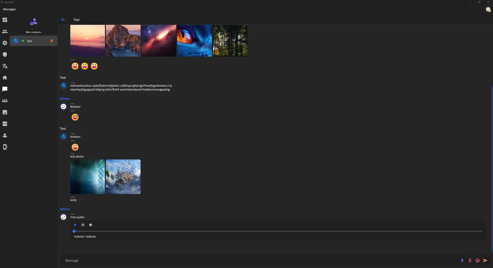 | 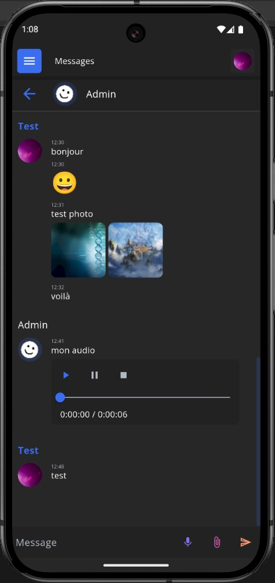 | 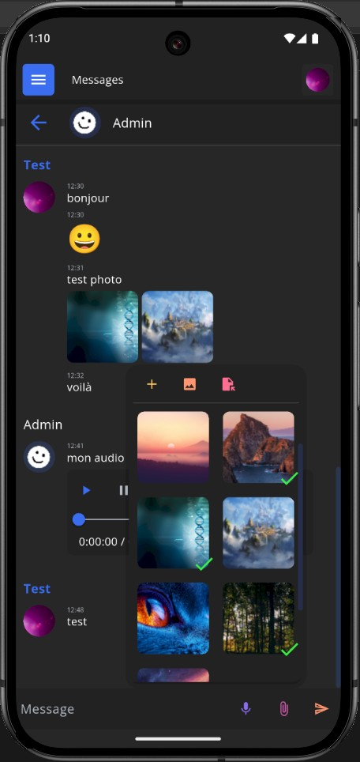 | 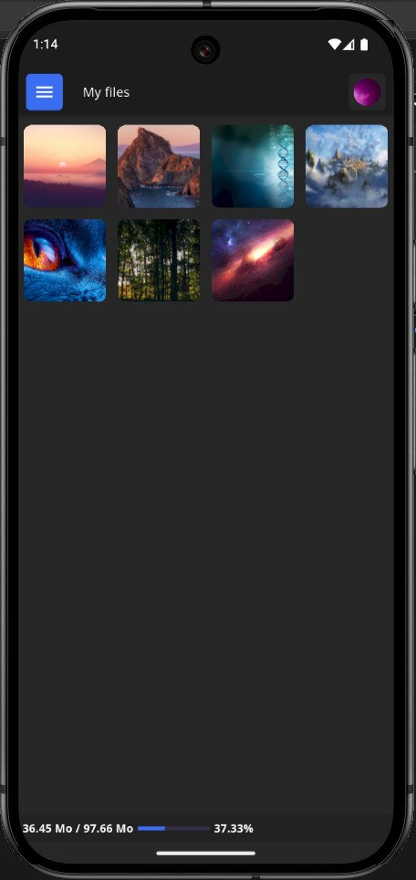 |

</details>

---

## 🌱 Origins: Axomind & Custom Framework

<div align="center">
  
</div>

AuroriaLink was born from the ongoing development project **Axomind**, an all-in-one team management application based on three interconnected modules: task scheduling (`🗓️`), idea structuring (`🧠`), and communication (`💬`).

This project is built upon a **personal modular Flutter framework**, designed around these strict principles:
* **Modularity**: Each block (UI, logic, services) is independent.
* **Interoperability**: Components interact dynamically without rigid dependencies.
* **Adaptability**: The application's behavior adjusts to the context (user, platform).
* **Separation of Concerns**: Strict partitioning between business logic, UI, data, and configuration.

<details>
<summary>👁️ Axomind App Preview</summary>

**Light Theme**
<p>
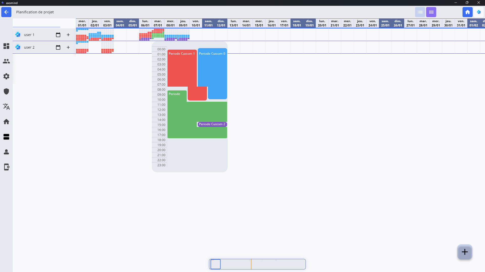
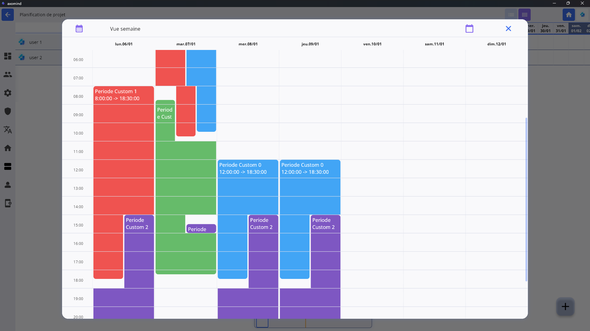
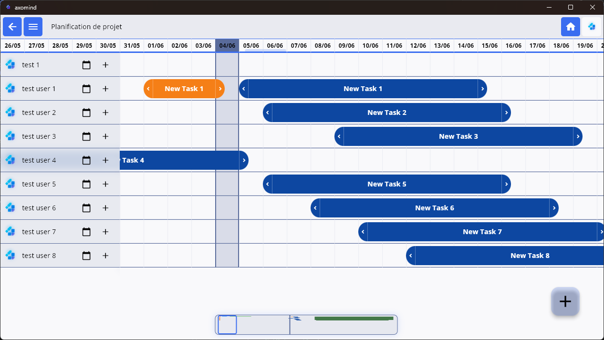
</p>

**Dark Theme**
<p>
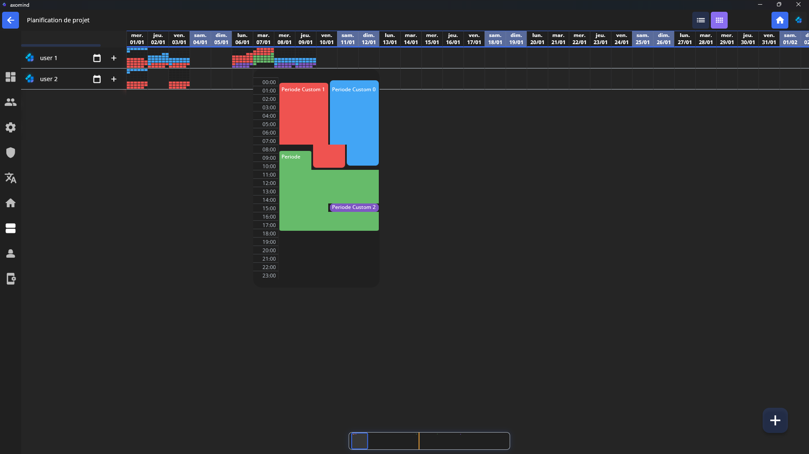
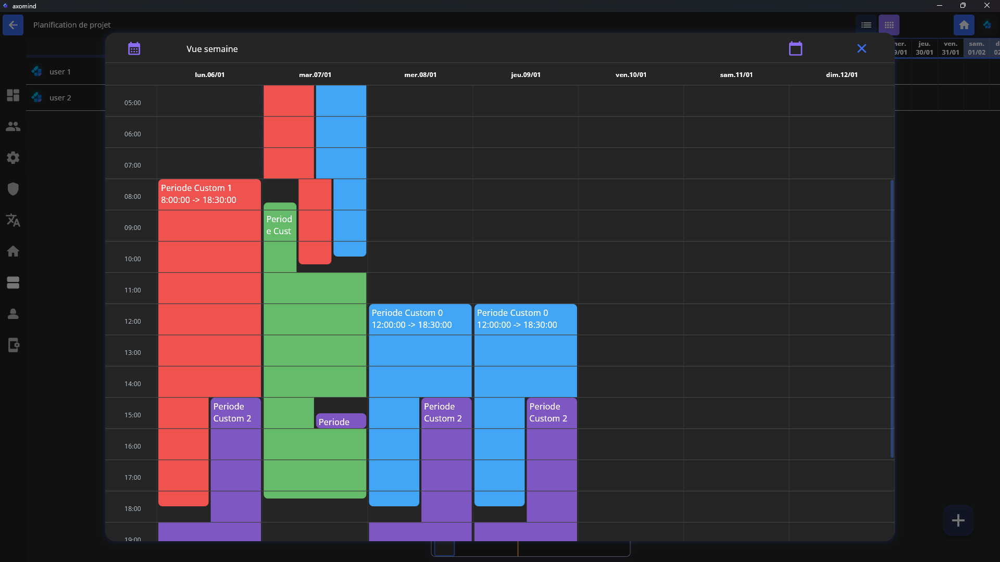
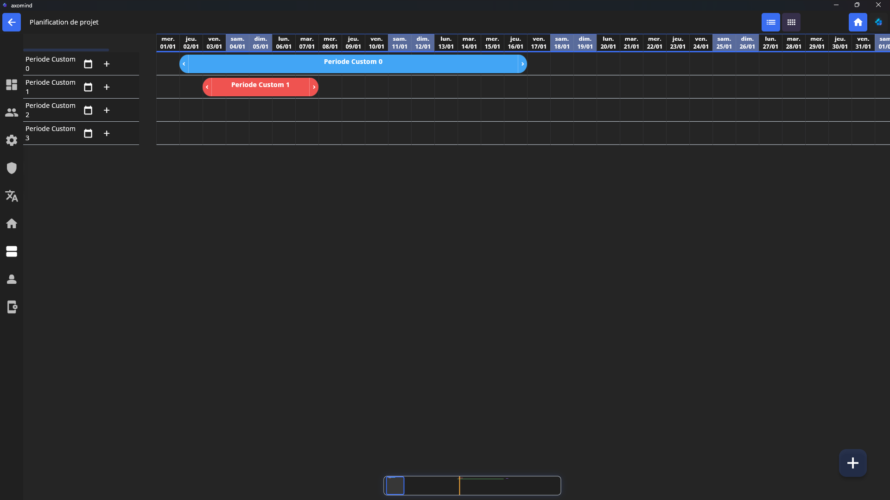
</p>

</details>

---

## 🤝 Contributing & Feedback

As an alpha version, this project thrives on community feedback. If you encounter a bug, have a feature request, or want to contribute, please feel free to open an issue on the repository.

---

## 👤 Author

<div align="center">
  <a href="https://materiaeobscurataelab.xyz/" target="_blank"></a>
</div>

---

## 🇫🇷 Version Française

<details>
<summary>Cliquez pour lire en français</summary>

<div align="center">
  
  <h1>AuroriaLink</h1>
  <p><strong>Une messagerie d'équipe contextuelle et temps réel.</strong></p>
</div>

**AuroriaLink** est une messagerie d'équipe contextuelle et temps réel, conçue pour résoudre la désynchronisation entre les outils de communication et les outils de production.

Le principe architectural fondamental est le **lien contextuel** : chaque fil de discussion est intrinsèquement lié à un élément de production précis. La conversation n'est plus une entité isolée, mais une métadonnée dynamique de l'objet auquel elle se rapporte, que ce soit **un nœud dans une arborescence de projet (mindmap `🧠`)** ou **une tâche dans un planificateur temporel (`🗓️`)**.

Cette approche garantit une traçabilité absolue et ancre la communication directement dans le flux de travail, supprimant le bruit informationnel des canaux généralistes.

Conçue avec une philosophie d'**optimisation intelligente**, AuroriaLink minimise les coûts serveur grâce à une gestion intelligente des ressources, tout en maintenant performance et sécurité.

### ⚠️ Statut du projet : Version Alpha

> Ce projet est actuellement en phase de développement actif. Des bugs et des comportements inattendus sont donc probables. Les contributions et retours d'expérience sont les bienvenus.

---

## 🚀 Télécharger la dernière version

<p align="center">
  
  
</p>

<div align="center">
  <table>
    <tr>
      <td align="center" width="33%">
        <a href="https://github.com/Sebastien-VZN/auroria_link/releases/download/alpha_0.4.0/app-android_0.4.0.apk">
          
        </a>
        <br/>
        <sub>APK • Toutes versions</sub>
      </td>
      <td align="center" width="33%">
        <a href="https://github.com/Sebastien-VZN/auroria_link/releases/download/alpha_0.4.0/windows_0.4.0.zip">
          
        </a>
        <br/>
        <sub>ZIP • Windows 10+</sub>
      </td>
      <td align="center" width="33%">
        <a href="https://github.com/Sebastien-VZN/auroria_link/releases/download/alpha_0.4.0/linux_0.4.0.tar.gz">
          
        </a>
        <br/>
        <sub>TAR.GZ • Toutes distros</sub>
      </td>
    </tr>
  </table>
</div>

<p align="center">
  <a href="https://github.com/Sebastien-VZN/auroria_link/releases">
    
  </a>
</p>

---

### ✨ Fonctionnalités Clés

-   **⚡ Communication Temps Réel** : Architecture basée sur un serveur **WebSocket (Node.js)** pour des échanges full-duplex instantanés avec monitoring heartbeat (30s) et reconnexion automatique.
-   **🔒 Confidentialité & Chiffrement Absolu** : La messagerie est **100% privée**. Tous les messages et fichiers sont **chiffrés au repos sur le serveur** avec **AES-256-GCM** (streaming chunks 8MB). Les communications transitent via **HTTPS** et **WSS (WebSocket Secure)**, garantissant une sécurité maximale de bout en bout.
-   **🚀 Backend Haute Performance** : Architecture cache RAM 4 niveaux (OPcache → APCu → Ramdisk → Redis) offrant **-80% charge CPU déchiffrement**, **+150% throughput**, et **×2 bande passante**. Connexions base de données persistantes et 11 index critiques assurent des requêtes ultra-rapides.
-   **⏱️ Rétention des Messages Optimisée** : Les messages sont conservés 15 jours sur le serveur et 3 mois sur le client, avec option de suppression automatique après 24h pour une confidentialité maximale. Nettoyage quotidien à minuit pour limiter la charge serveur et optimiser les coûts de stockage.
-   **📱 Support Multi-Device** : Basculez facilement entre vos appareils (desktop ou mobile) avec gestion automatique des sessions. **Maximum 2 connexions simultanées** par utilisateur pour une sécurité et gestion des ressources optimales.
-   **🔄 Reconnexion Intelligente** : Reconnexion automatique avec backoff exponentiel en cas de perte de réseau, avec validation 2FA si nécessaire pour garantir la sécurité de votre session.
-   **🛡️ Sécurité 5 Couches** : Validation des routes, protection brute force avec tracking IP, 2FA par email (PIN 6 chiffres), chiffrement AES-256-GCM, et gestion intelligente multi-device.
-   **👥 Canaux de Discussion Privés** : Créez des canaux cloisonnés pour des équipes, projets ou sujets spécifiques, accessibles uniquement aux membres autorisés.
-   **🎤 Messagerie Audio Séquentielle** : Enregistrez et envoyez des clips audio chiffrés pour créer un fil de conversation vocal fluide.
-   **📎 Partage de Fichiers Complet** : Partagez documents, images, vidéos et fichiers audio chiffrés (jusqu'à 10 fichiers par message, 10 Mo par fichier), directement dans vos conversations contextuelles.
-   **📌 Gestion Intelligente des Fichiers** : Les fichiers sont conservés 15 jours sur le serveur, ou 3 mois s'ils sont épinglés. Chaque épinglage réinitialise le compteur à 3 mois, permettant de conserver uniquement les fichiers importants et d'optimiser le stockage serveur.
-   **🧩 Modularité & Intégration** : Conçu comme un module autonome pouvant être intégré comme service via son API.
-   **💪 Backend Robuste** : Un backend en **PHP 8.4 / PostgreSQL 17** avec **PHP-FPM (80 workers)** assure la persistance des données, la gestion des utilisateurs et des droits avec une fiabilité de niveau entreprise.
-   **🔗 API Contextuelle** : Créez et liez dynamiquement des conversations à des identifiants d'objets externes de manière sécurisée.
-   **🔐 Contrôle d'Accès** : Gestion des droits basée sur les rôles pour un accès précis et contextuel aux conversations.

---

## 🛠️ Stack Technologique

<p align="center">
  <a href="https://www.php.net/" target="_blank"></a>
  <a href="https://flutter.dev/" target="_blank"></a>
  <a href="https://nodejs.org/" target="_blank"></a>
  <a href="https://www.postgresql.org/" target="_blank"></a>
  <a href="https://www.nginx.com/" target="_blank"></a>
  <a href="https://www.debian.org/" target="_blank"></a>
</p>

---

## 🏗️ Architecture

**Couches d'Architecture :**

<p align="center">
  
  
  
  
</p>

```
╔═════════════════════════════════════════════════════════════╗
║                  Applications Clientes                      ║
║           Flutter (Android, Windows, Linux)                 ║
║                                                             ║
║  • Messagerie contextuelle                                  ║
║  • Partage de fichiers chiffrés (AES-256-GCM)               ║
║  • Messagerie audio                                         ║
║  • Auto-reconnexion (backoff exponentiel)                   ║
╚════════════╦═════════════════════════╦══════════════════════╝
             ║ HTTP/HTTPS              ║ WSS (WebSocket Secure)
             ║ (auth/data)             ║ (messagerie temps réel)
             ↓                         ↓
╔═════════════════════════╗   ╔════════════════════════════════╗
║   Serveur Backend       ║   ║   Serveur WebSocket Temps Réel ║
║   PHP 8.4 + Nginx       ║   ║   Node.js (quantive-ws)        ║
║   PHP-FPM (80 workers)  ║   ║                                ║
║                         ║   ║  • Port 8080 (clients)         ║
║  Couches de sécurité :  ║   ║  • Port 8081 (API interne)     ║
║  1. Validation routes   ║   ║  • Heartbeat 30s (ping/pong)   ║
║  2. Contrôle brute force║   ║  • Multi-device (max 2)        ║
║  3. 2FA (PIN email)     ║   ║  • Auth via validation PHP     ║
║  4. AES-256-GCM         ║←──║  • Gestion des sessions        ║
║  5. Gestion multi-device║   ╚════════════════════════════════╝
║                         ║
║  Cache 4 niveaux :      ║
║  • OPcache (bytecode)   ║
║  • APCu (UUID→path)     ║
║  • Ramdisk (4GB)        ║
║  • Redis (2GB LRU)      ║
╚════════╦════════════════╝
         ║ PDO persistant
         ║ 11 index critiques
         ↓
╔═══════════════════════════════════════════════════════════════╗
║               Base de données PostgreSQL 17                   ║
║                                                               ║
║  • Messages chiffrés (AES-256-GCM)                            ║
║  • Rétention : 15 jours serveur / 3 mois client               ║
║  • Rétention intelligente (épinglage réinitialise 3 mois)     ║
║  • Gestion utilisateurs, permissions & rôles                  ║
║  • Indexé : users (auth), security (IP), messages (JSONB)     ║
╚═══════════════════════════════════════════════════════════════╝
```

**Fonctionnement :**
1. Le **Client** se connecte via HTTPS pour auth/données et WSS pour la messagerie temps réel
2. Le **Serveur WebSocket** gère la communication bidirectionnelle instantanée avec heartbeat (30s) et support multi-device (max 2 connexions)
3. Le **Backend** gère 5 couches de sécurité (validation routes, brute force, 2FA, AES-256-GCM, multi-device), avec cache RAM 4 niveaux pour des performances optimales
4. La **Base de données** stocke les données chiffrées avec politiques de rétention intelligentes et 11 index critiques pour l'optimisation des requêtes

**Optimisations de performance** (déployées 2025-11-04) :
- Cache RAM 4 niveaux : -80% charge CPU déchiffrement, +150% throughput, ×2 bande passante
- Connexions PDO persistantes : -20-40% latence DB
- 11 index PostgreSQL : Optimisation auth, vérifications sécurité et requêtes messages

---

## 💻 Plateformes supportées

| Plateforme | Statut                         |
|:----------:|:-------------------------------|
| Android    | ✅ Supporté                    |
| Windows    | ✅ Supporté                    |
| Linux      | ✅ Supporté                    |
| macOS      | ❌ Non supporté pour le moment |
| iOS        | ❌ Non supporté pour le moment |

---
## 🚀 Instructions d'Installation

<details>
<summary>Cliquez pour voir les instructions d'installation</summary>

### 📱 Installation sur Android

> **Important :** Notre application n'est pas (encore) sur le Google Play Store. L'installation nécessite quelques étapes manuelles pour autoriser les sources externes. C'est une procédure standard et sécurisée.

#### Étape 1 : Autoriser les sources inconnues
1.  **Téléchargez le fichier `app-android.apk`** depuis le lien des [dernières versions](https://github.com/Sebastien-VZN/auroria_link/releases/latest ).
2.  Ouvrez le fichier téléchargé (depuis votre barre de notifications ou votre gestionnaire de fichiers).
3.  Un message de sécurité va apparaître : *"Pour votre sécurité, votre téléphone n'est pas autorisé à installer des applications inconnues de cette source."*
4.  Cliquez sur le bouton **Paramètres**.
5.  Activez l'option **Autoriser pour cette source** (ou *Sources inconnues*).
6.  Revenez en arrière avec la flèche de navigation ; l'installation devrait maintenant commencer.

#### Étape 2 : Contourner Google Play Protect
1.  Après l'étape 1, une autre fenêtre peut s'ouvrir, intitulée **"Application bloquée par Play Protect"**.
2.  Ne cliquez pas sur "OK". Cherchez et cliquez sur **Détails** ou **Plus de détails** (souvent un petit lien en bas).
3.  Un nouveau bouton apparaîtra. Cliquez sur **Installer quand même**.

Et voilà, l'application est installée !

---
### 💻 Installation sur Windows

> **Avertissement :** Votre antivirus (y compris Windows Defender) peut afficher une alerte. C'est un comportement normal pour les applications qui ne sont pas certifiées par Microsoft. Notre fichier est sûr.

1.  **Téléchargez l'archive `windows.tar.gz`** depuis le lien des [dernières versions](https://github.com/Sebastien-VZN/auroria_link/releases/latest ).
2.  **Décompressez l'archive.**
3.  **Exécutez le fichier `.exe`** qui se trouve dans le dossier décompressé.
4.  Si une fenêtre bleue "Windows a protégé votre ordinateur" apparaît :
    * Cliquez sur le lien **Informations complémentaires**.
    * Cliquez ensuite sur le bouton **Exécuter quand même**.
5.  Si votre antivirus met le fichier en quarantaine, ouvrez les paramètres de votre antivirus et créez une exception pour autoriser le fichier.

---

### 🐧 Installation sur Linux

> Pour Linux, il suffit de rendre le fichier exécutable avant de le lancer.

1.  **Téléchargez l'archive `linux.tar.gz`** depuis le lien des [dernières versions](https://github.com/Sebastien-VZN/auroria_link/releases/latest ) et décompressez-la.
2.  **Rendez le fichier de l'application exécutable.** Vous avez deux options :
    * **Via l'interface graphique :**
        1.  Faites un clic droit sur le fichier de l'application.
        2.  Allez dans **Propriétés** → onglet **Permissions**.
        3.  Cochez la case **"Autoriser l'exécution du fichier comme un programme"**.
    * **Via le terminal :**
        ```bash
        chmod +x nom-du-fichier
        ```
        *(Remplacez `nom-du-fichier` par le nom réel du fichier exécutable)*
3.  **Lancez l'application** en double-cliquant dessus ou en exécutant la commande suivante dans le terminal :
    ```bash
    ./nom-du-fichier
    ```
Si vous rencontrez des problèmes, n'hésitez pas à nous contacter ou à ouvrir une "issue".

</details>

</details>
