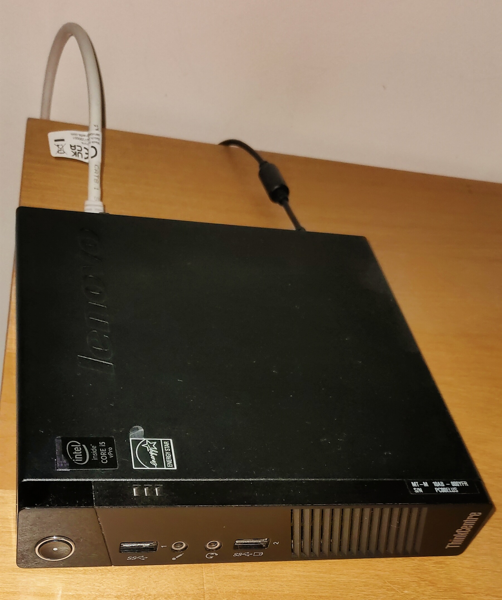
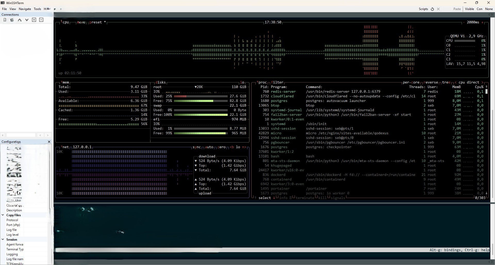
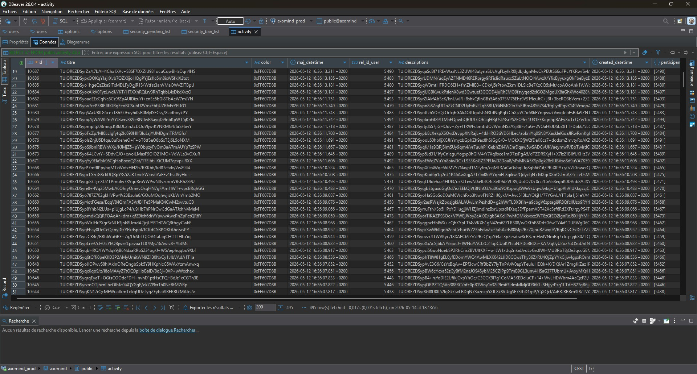

  
  <h1>AuroriaLink</h1>
  
<strong>A real-time team messaging solution.</strong>

  
  

    
  

  

    
    
  

---

## 🚀 Get the Latest Version

  <table>
    <tr>
      <td align="center" width="33%">
        
         
        APK • <a href="INSTALL_ANDROID.md">Installation guide</a>
      </td>
      <td align="center" width="33%">
        
         
        ZIP • <a href="INSTALL_WINDOWS.md">Installation guide</a>
      </td>
      <td align="center" width="33%">
        
         
        Debian 13 • <a href="INSTALL_LINUX.md">Installation guide</a>
      </td>
    </tr>
  </table>

  

## 🎥 Preview

  
  
<em>▶ Click to watch the demo — real-time messaging in action</em>

## 📋 Table of Contents

- [⚠️ Project Status](#️-project-status-beta-version)
- [✨ Key Features](#-key-features)
- [💻 Supported Platforms](#-supported-platforms)
- [🎨 Gallery](#-gallery)
- [📊 Performance & Real Cost](#-performance--real-cost)
- [🤖 Bot API](#-bot-api)
- [🌐 About Axomind](#-about-axomind)
- [🤝 Bug Reports & Feedback](#-bug-reports--feedback)
- [👤 Author](#-author)
- [🇫🇷 Version Française](#-version-française)

---

## ⚠️ Project Status: Beta Version

> This project is in active development. Bugs and unexpected behaviors are likely. Feedback is welcome.

> **📧 About emails**
> Outbound mail from the self-hosted server is blocked at the ISP level, and alternative relays haven't given reliable delivery for this setup. So **everything that would normally rely on email is switched off for now** — account verification, password reset, and two-factor authentication. Accounts work without any email step.
> The email layer is built in and decoupled from the regular login flow. It will be turned back on once the platform moves to a hosting provider with reliable outbound mail — nothing else will change for you.

---

## ✨ Key Features

**🔒 Privacy & Security**
- 🔒 **Strong Encryption** — Messages and files are encrypted with AES-256-GCM, both when stored on the server and while being sent. Your conversations stay private.
- 🛡️ **Two-factor authentication** — Email-code 2FA at login with anti-spam and bad-attempt detection (currently off — see the email notice above).
- 🔐 **Access Control** — Each member only sees what they're allowed to, with role-based permissions

**⚡ Real-Time**
- ⚡ **Instant Delivery** — Messages arrive instantly, with automatic reconnection if the link drops
- 📱 **Multi-Device** — Stay signed in on **up to 2 devices for AuroriaLink** (1 desktop + 1 mobile). If you also use Axomind, you get **2 more sessions in parallel** — up to 4 active sessions in total per account, by design

**🎨 Interface**
- 🎨 **26 Themes** — Each with a light and a dark variant, switchable on the fly, with Aurora animations and glassmorphism (same theme set as Axomind)

**💬 Messaging**
- 👥 **Private Channels** — Dedicated spaces for your teams, projects, or topics
- 🎤 **Audio Messages** — Record and send voice clips in your conversations
- 📎 **File Sharing** — Up to 10 files per message (documents, images, videos, audio — 10 MB each)
- ⏱️ **Retention** — Messages kept 1 year on the server / 2 years locally, with optional 24h auto-delete · Files kept 1 month (3 months if pinned)

**🧩 Integrations**
- 🤖 **Bot API** — Send messages from CI/CD, monitoring, or automation tools (n8n, Make, Zapier...)
- 🔗 **Contextual Linking** — Attach conversations to your projects, tasks, or any external resource

---

🛠️ <strong>Tech Stack</strong> — for the curious

 

  
  
  
  
  
  

**How it works (in plain words):**
1. **The app** talks to the server over a secure connection (HTTPS), and a separate live channel keeps everything in sync in real time
2. **The live channel** can keep 2 sessions open at once for AuroriaLink (1 desktop + 1 mobile). The same design supports 2 extra sessions for Axomind in parallel — 4 active sessions total per account
3. **The server** protects accounts on several layers: route checks, attack protection, AES-256-GCM encryption, and a unique token per session
4. **The database** stores everything encrypted, keeps data only as long as needed, and is tuned for fast reads on conversations and messages

---

## 💻 Supported Platforms

| Platform | Status                 |
|:--------:|:-----------------------|
| Android  | ✅ Supported           |
| Windows  | ✅ Supported           |
| Linux    | ✅ Supported           |
| macOS    | ❌ Not yet supported   |
| iOS      | ❌ Not yet supported   |

---

## 🎨 Gallery

### 💻 Desktop Experience

  
  

  
  

  
  

  
  

  
  

  
  

  
  

  

### 📱 Mobile Experience

  
  
  
  
  

  
  
  
  
  

  
  
  
  
  

---

## 📊 Performance & Real Cost

A factual overview of the hardware running the platform, the measured load it handles, and the equivalent cost on a major cloud provider. Every number below was measured on the production server on 2026-05-12.

The same infrastructure powers AuroriaLink and Axomind, so the hardware, latencies and costs apply to both.

### Hardware

The full stack runs on a single refurbished mini-PC.

  
   
  <em>Production server</em>

| Item | Value |
|---|---|
| Machine | Refurbished business mini-PC (Intel i5, ~2013) |
| CPU / RAM | 2 cores, 4 threads · 16 GB |
| Storage | SSD |
| Power envelope | 35 W TDP |
| Form factor | 17 × 17 × 3.4 cm |
| Purchase price | ~100 € (second-hand) |
| Electricity | ~8 €/month |

### Measured under load

Two synthetic load tests, replayed against the production server. Each test originated from a single client IP, which is a worse condition than real distributed traffic.

**Messaging — 3,691 requests, 200 concurrent users in burst:**

| Metric | Value |
|---|---|
| Failures | 0 |
| Median (p50) | 109 ms |
| 95th percentile | 196 ms |
| 99th percentile | 240 ms |
| Total duration | 120 s |

**Planning, mind maps and activities (shared backend) — 5,255 requests, 200 concurrent users in burst:**

| Metric | Value |
|---|---|
| Failures | 0 |
| Median (p50) | 78 ms |
| 95th percentile | 197 ms |
| 99th percentile | 568 ms |
| Throughput | ~29 req/s |
| Total duration | 183 s |

CPU peaked around 80 % per core during the burst; memory and disk usage remained well within limits.

  
   
  <em>System metrics captured during the peak of the burst test</em>

### Capacity estimate

| Profile | Capacity |
|---|---|
| Concurrent active users (normal usage) | ~600 |
| Total daily users (with realistic turnover) | ~2,000 |

In normal usage, an active user generates roughly one to two small requests per minute — an order of magnitude below the burst test rate.

### Cost comparison

| Setup | Per month | Per year | Over 5 years |
|---|---:|---:|---:|
| Self-hosted (current capacity) | ~8 € | ~96 € | ~480 € |
| AWS equivalent (t3.large / m5.large class) | ~60–70 € | ~720–840 € | ~3,600–4,200 € |
| Self-hosted, scaled to ~15,000 concurrent users | ~30 € | ~360 € | ~1,800 € |
| AWS equivalent at that scale | ~600 € | ~7,200 € | ~36,000 € |

Across both scenarios, the self-hosted setup runs at roughly 85–95 % below the cost of the equivalent managed instance.

### Architecture choices that keep the load low

- The client keeps a local copy of the data and reads it directly; the server is only contacted for what has actually changed since the last sync.
- An in-memory cache sits in front of the database, so most reads never reach the disk.
- Deletions are propagated as small markers, so clients clean up locally without a full re-sync.

### Encryption at rest (observable)

Sensitive text fields (message bodies, conversation titles, planning entries, mind map nodes) are encrypted with AES-256-GCM before being written to the database. Even with direct SQL access to the production database, the stored values are ciphertext — the plain text is never visible at the storage layer.

  
   
  <em>Direct SQL view of the shared production database — title and description columns hold ciphertext only.</em>

### Reproducibility and observability

- The load tests are scripted and can be re-run on demand against the production server.
- Server health is monitored live (CPU, memory, cache hit rate).
- The codebase includes 294 client-side integration tests and 400+ CI/CD pipelines that run on every change, plus benchmark scripts for server-side load and DevTools-based profiling on the client side (CPU, GPU, memory).

> The cost is a realistic estimate based on the hardware's measured power draw; the latencies are what the load tests produced.

---

## 🤖 Bot API

  

Send automated messages into any conversation from your CI/CD, monitoring, or automation tools (n8n, Zapier, Make...). → **[Full documentation](API_BOT.md)**

---

## 🌐 About Axomind

  

**Axomind** is a broader project that builds on AuroriaLink. It brings together three connected modules:
- **🗓️ Project planning** — Timeline-based Gantt
- **🧠 Mind maps** — For ideas and knowledge
- **💬 Messaging** — AuroriaLink, integrated as the communication layer

The core idea behind Axomind is **contextual linking**: each conversation is attached to a task or a mind map node, so the discussion and the work it relates to stay in the same place. AuroriaLink remains available as a **standalone messaging app** for people who only need the chat side.

### Custom Modular Framework

Both AuroriaLink and Axomind run on a **custom modular framework** built around a few simple rules:
* **Modular** — the interface, the logic, and the services stay independent of one another
* **Flexible** — pieces work together without being tied together
* **Context-aware** — the app adapts to the user and the device
* **Clean layers** — interface, logic, data, and settings each live in their own layer

  

---

## 🤝 Bug Reports & Feedback

AuroriaLink is in beta. Bug reports, feature ideas and general feedback are welcome — open an issue on the repository, every entry is read and considered.

The application source code is proprietary and kept private as a deliberate security choice. This public repository contains the documentation, install guides and release builds — not the codebase. External code contributions aren't part of the project model.

---

## 👤 Author

  

---

## 🇫🇷 Version Française

Cliquez pour lire en français

  
  <h1>AuroriaLink</h1>
  
<strong>Une messagerie d'équipe privée et chiffrée.</strong>

## ⚠️ Statut du projet : Version Beta

> Ce projet est en développement actif. Des bugs et comportements inattendus sont probables. Les retours sont bienvenus.

> **📧 À propos des emails**
> L'envoi de mails sortants depuis le serveur autohébergé est bloqué au niveau du FAI, et les relais alternatifs n'ont pas donné de livraison fiable dans cette configuration. **Tout ce qui dépend de l'email est donc désactivé pour le moment** — vérification de compte, réinitialisation de mot de passe et double authentification. Les comptes fonctionnent sans étape email.
> La couche email est intégrée et découplée du flux de connexion normal. Elle sera réactivée quand la plateforme passera chez un provider d'hébergement où l'envoi sortant est fiable — rien d'autre ne changera pour vous.

---

## 🎥 Aperçu

  
  
<em>▶ Cliquez pour regarder la démo — messagerie en temps réel en action</em>

---

## ✨ Fonctionnalités Clés

**🔒 Confidentialité & Sécurité**
- 🔒 **Chiffrement fort** — Messages et fichiers chiffrés en AES-256-GCM, à la fois sur le serveur et lors de l'envoi. Vos conversations restent privées.
- 🛡️ **Double authentification** — 2FA par code email à la connexion avec détection des tentatives suspectes (actuellement désactivée — voir le bloc email ci-dessus).
- 🔐 **Contrôle d'Accès** — Chaque membre ne voit que ce à quoi il est autorisé, avec des permissions par rôle

**⚡ Temps Réel**
- ⚡ **Livraison Instantanée** — Les messages arrivent en direct, avec reconnexion automatique en cas de coupure
- 📱 **Multi-Appareils** — Restez connecté sur **2 appareils pour AuroriaLink** (1 desktop + 1 mobile). Si vous utilisez aussi Axomind, vous disposez de **2 sessions supplémentaires en parallèle** — jusqu'à 4 sessions actives au total par compte, par design

**🎨 Interface**
- 🎨 **26 Thèmes** — Chacun avec une variante claire et une sombre, interchangeables à la volée, avec animations Aurora et glassmorphism (le même set de thèmes qu'Axomind)

**💬 Messagerie**
- 👥 **Canaux Privés** — Des espaces dédiés pour vos équipes, projets ou sujets
- 🎤 **Messages Audio** — Enregistrez et envoyez des clips vocaux dans vos conversations
- 📎 **Partage de Fichiers** — Jusqu'à 10 fichiers par message (documents, images, vidéos, audio — 10 Mo chacun)
- ⏱️ **Rétention** — Messages conservés 1 an sur le serveur / 2 ans en local, avec suppression automatique optionnelle après 24h · Fichiers conservés 1 mois (3 mois si épinglé)

**🧩 Intégrations**
- 🤖 **API Bot** — Envoyez des messages depuis vos outils CI/CD, monitoring ou plateformes d'automatisation (n8n, Make, Zapier...)
- 🔗 **Lien Contextuel** — Associez des conversations à vos projets, tâches ou ressources externes

---

🛠️ <strong>Stack Technologique</strong> — pour les curieux

 

  
  
  
  
  
  

**Fonctionnement (en clair) :**
1. **L'application** dialogue avec le serveur via une connexion sécurisée (HTTPS), et un canal temps réel séparé garde tout synchronisé en direct
2. **Le canal temps réel** peut maintenir 2 sessions ouvertes pour AuroriaLink (1 desktop + 1 mobile). Le même design supporte 2 sessions supplémentaires pour Axomind en parallèle — 4 sessions actives au total par compte
3. **Le serveur** protège les comptes sur plusieurs niveaux : vérifications des accès, protection contre les attaques, chiffrement AES-256-GCM, et un jeton unique par session
4. **La base de données** stocke tout de façon chiffrée, ne conserve les données que le temps utile, et est optimisée pour des lectures rapides sur les conversations et les messages

---

## 💻 Plateformes supportées

| Plateforme | Statut                         |
|:----------:|:-------------------------------|
| Android    | ✅ Supporté                    |
| Windows    | ✅ Supporté                    |
| Linux      | ✅ Supporté                    |
| macOS      | ❌ Non supporté pour le moment |
| iOS        | ❌ Non supporté pour le moment |

---

## 📊 Performance & Coût Réel

Aperçu factuel du matériel qui fait tourner la plateforme, de la charge mesurée et du coût équivalent chez un gros fournisseur cloud. Tous les chiffres ci-dessous ont été mesurés sur le serveur de production le 12 mai 2026.

La même infrastructure fait tourner AuroriaLink et Axomind, donc le matériel, les latences et les coûts s'appliquent aux deux.

### Matériel

L'ensemble de la stack tourne sur un seul mini-PC reconditionné.

  
   
  <em>Serveur de production</em>

| Élément | Valeur |
|---|---|
| Machine | Mini-PC de bureau reconditionné (Intel i5, ~2013) |
| CPU / RAM | 2 cœurs, 4 threads · 16 Go |
| Stockage | SSD |
| Enveloppe énergétique | 35 W TDP |
| Format | 17 × 17 × 3,4 cm |
| Prix d'achat | ~100 € (occasion) |
| Électricité | ~8 €/mois |

### Mesuré sous charge

Deux tests de charge synthétiques, rejoués contre le serveur de production. Chaque test était émis depuis une seule IP cliente, ce qui est une condition plus défavorable qu'un trafic réel distribué.

**Messagerie — 3 691 requêtes, 200 utilisateurs simultanés en burst :**

| Métrique | Valeur |
|---|---|
| Échecs | 0 |
| Médiane (p50) | 109 ms |
| 95e percentile | 196 ms |
| 99e percentile | 240 ms |
| Durée totale | 120 s |

**Planning, cartes mentales et activités (backend partagé) — 5 255 requêtes, 200 utilisateurs simultanés en burst :**

| Métrique | Valeur |
|---|---|
| Échecs | 0 |
| Médiane (p50) | 78 ms |
| 95e percentile | 197 ms |
| 99e percentile | 568 ms |
| Débit | ~29 req/s |
| Durée totale | 183 s |

Le CPU a culminé à environ 80 % par cœur pendant le burst ; mémoire et disque sont restés largement sous leurs limites.

  
   
  <em>Métriques système capturées au pic du test de charge</em>

### Capacité estimée

| Profil | Capacité |
|---|---|
| Utilisateurs actifs simultanés (usage normal) | ~600 |
| Total utilisateurs par jour (avec rotation réaliste) | ~2 000 |

En usage normal, un utilisateur actif génère environ une à deux petites requêtes par minute — un ordre de grandeur en dessous du débit du burst test.

### Comparaison de coût

| Configuration | Par mois | Par an | Sur 5 ans |
|---|---:|---:|---:|
| Autohébergé (capacité actuelle) | ~8 € | ~96 € | ~480 € |
| Équivalent AWS (classe t3.large / m5.large) | ~60–70 € | ~720–840 € | ~3 600–4 200 € |
| Autohébergé, monté à ~15 000 utilisateurs simultanés | ~30 € | ~360 € | ~1 800 € |
| Équivalent AWS à cette échelle | ~600 € | ~7 200 € | ~36 000 € |

Sur les deux scénarios, la configuration autohébergée tourne à environ 85–95 % en dessous du coût de l'instance gérée équivalente.

### Choix d'architecture qui maintiennent la charge basse

- Le client garde une copie locale des données et la lit directement ; le serveur n'est contacté que pour ce qui a effectivement changé depuis la dernière synchronisation.
- Un cache en mémoire vive est placé devant la base de données, donc la plupart des lectures ne touchent jamais le disque.
- Les suppressions sont propagées sous forme de petits marqueurs : les clients nettoient en local sans re-synchronisation complète.

### Chiffrement au repos (observable)

Les champs texte sensibles (contenu des messages, titres de conversations, entrées de planning, nœuds de cartes mentales) sont chiffrés en AES-256-GCM avant d'être écrits en base de données. Même avec un accès SQL direct à la base de production, les valeurs stockées sont du chiffré — le texte clair n'apparaît jamais à la couche stockage.

  
   
  <em>Vue SQL directe de la base de production partagée — les colonnes titre et description ne contiennent que du chiffré.</em>

### Reproductibilité et observabilité

- Les tests de charge sont scriptés et peuvent être rejoués à la demande contre le serveur de production.
- La santé du serveur est surveillée en direct (CPU, mémoire, taux de hit du cache).
- Le code embarque 294 tests d'intégration côté client et 400+ pipelines CI/CD qui tournent à chaque changement, plus des scripts de benchmark côté serveur et du profiling via DevTools côté client (CPU, GPU, mémoire).

> Le coût est une estimation réaliste basée sur la consommation électrique mesurée du matériel ; les latences sont les valeurs produites par les tests de charge.

---

## 🤖 API Bot

  

Envoyez des messages automatisés dans vos conversations depuis vos outils CI/CD, monitoring ou plateformes d'automatisation (n8n, Zapier, Make...). → **[Documentation complète](API_BOT.md)**

---

## 🌐 À propos d'Axomind

  

**Axomind** est un projet plus large qui s'appuie sur AuroriaLink. Il réunit trois modules connectés :
- **🗓️ Planification** — Diagramme Gantt sur une chronologie
- **🧠 Cartes mentales** — Pour les idées et les connaissances
- **💬 Messagerie** — AuroriaLink, intégré comme couche de communication

L'idée centrale d'Axomind est le **lien contextuel** : chaque conversation est rattachée à une tâche ou à un nœud de carte mentale, pour que la discussion et le travail qui s'y rapporte restent au même endroit. AuroriaLink reste disponible comme **application de messagerie autonome** pour celles et ceux qui n'ont besoin que de la partie chat.

### Framework Modulaire Personnalisé

AuroriaLink et Axomind reposent sur un **framework modulaire personnalisé**, conçu autour de quelques règles simples :
* **Modulaire** — l'interface, la logique et les services restent indépendants
* **Souple** — les éléments collaborent sans être figés ensemble
* **Adapté au contexte** — l'application s'ajuste à l'utilisateur et à l'appareil
* **Couches nettes** — interface, logique, données et réglages vivent chacun dans leur propre couche

  

---

## 🤝 Bugs & Retours

AuroriaLink est en beta. Les remontées de bugs, suggestions et retours d'usage sont les bienvenus — ouvrez une issue sur le dépôt, chaque entrée est lue et étudiée.

Le code source de l'application est propriétaire et reste privé par choix de sécurité. Ce dépôt public contient la documentation, les guides d'installation et les builds de release — pas le code de l'application. Les contributions de code externes ne font pas partie du modèle du projet.

---

